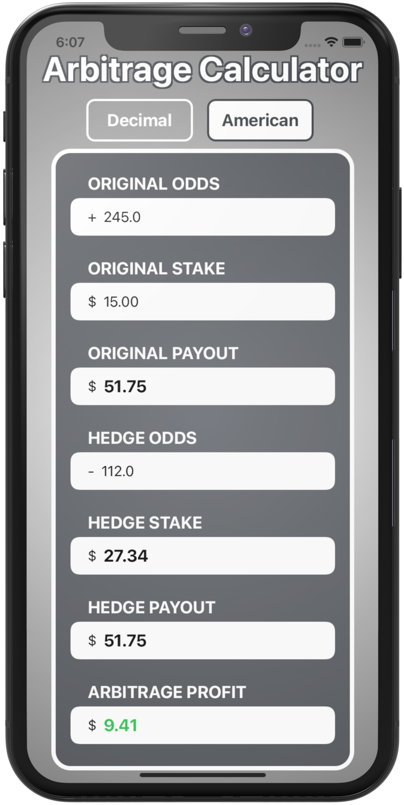
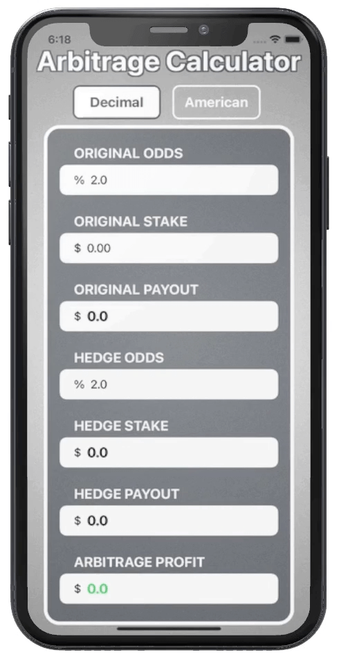

<!-- # Hello!
*Thanks for stopping by*. This repo serves as a kind of ever-changing portfolio of projects I'm currently excited about; please feel free to look around. -->
# Arbitrage Calculator
Arbitrage Calculator is an iOS app which allows for easy and accurate arbitrage calculations. Arbitrage Calculator provides instantous updates for hedge bets, payouts, and profits based on inputted odds and stake amount.    

&nbsp;&nbsp;&nbsp;&nbsp;&nbsp;&nbsp;&nbsp;&nbsp;&nbsp;&nbsp;

## Thanks for stopping by!

# Contact Info:

- Email: reich597@umn.edu
